  

  <strong>Computer Science Student <a href="https://www.cesar.school/">@CESAR School</a> | Backend | AI Engineer | Automation</strong>

  🌐 <strong>Choose your language / Escolha seu idioma</strong>  
  <strong>English · current</strong>  ·  
  

## 👋 A little about me

I connect **AI agents, backend APIs and automations** to build useful applications — from document assistants to tools that run in the terminal.

- 🎓 **Computer Science** student at **CESAR School**, based in Recife, Brazil.
- 🧠 **Applied AI:** LLMs, RAG, tool-calling agents and local models.
- ⚙️ **Backend:** Python, FastAPI, REST APIs and PostgreSQL.
- 🔗 **Automations:** connecting tools, data and everyday workflows.

  
  
  

## 🚀 Featured projects

<table>
<tr>
<td width="50%" valign="top">

<strong>📂 Explore more: backend, data & automations</strong>

- [Database System](https://github.com/DaviSantiago01/Projeto-Banco-De-Dados) — academic team project with Java, Spring Boot, JDBC, PostgreSQL and React.
- [Product API](https://github.com/DaviSantiago01/Registro-Produto-API) — product registration, validation and event logging with FastAPI and SQLite.
- [File Organizer](https://github.com/DaviSantiago01/Organizador-De-Arquivos-Py) — Python automations to sort downloaded files by category.

## 🛠️ Technologies & tools

**Backend & data**
     

**AI & automations**
     

**Interfaces & infrastructure**
      
