  🌐 <strong>English</strong> · <a href="./README.pt-BR.md">Português (BR)</a>

  <picture>
    <source media="(prefers-color-scheme: dark)" srcset="./assets/header-dark.svg">
    <source media="(prefers-color-scheme: light)" srcset="./assets/header-light.svg">
    
  </picture>

## 👋 About me

I build **backend systems and applied AI products**, with a focus on turning AI experiments into useful, maintainable applications.

- 🎓 **5th-semester Computer Science student at CESAR School**, based in Recife, Brazil.
- 🤖 Most of my projects involve **LLMs, RAG, AI agents and tool calling**, usually with Python, FastAPI and PostgreSQL.
- 🧪 I also care about the engineering around AI: **APIs, databases, automated testing, CI/CD, Docker and observability**.
- 🌱 Currently deepening my knowledge of **AI engineering, cloud and production-ready systems**.

## 🤝 Find me around the web

Follow my work, projects and technical content:

💼 [**LinkedIn** (linkedin.com/in/davisantiagoia)](https://www.linkedin.com/in/davisantiagoia/) · 📸 [**Instagram** (@davisantiago.ia)](https://www.instagram.com/davisantiago.ia/) · 🌐 [**Portfolio** (davisantiagoia.site)](https://davisantiagoia.site/) · ✉️ [**Email** (daaviisantiago@gmail.com)](mailto:daaviisantiago@gmail.com)

## 🚀 Featured projects

<table>
<tr>
<td width="50%" valign="top">

### 🤖 Terminal Agent

AI assistant for terminal workflows, tool-based task management, real-time logs and persistent execution history in PostgreSQL.

**Python · LangChain · LangGraph · PostgreSQL**

[View project →](https://github.com/DaviSantiago01/Terminal-Agent)

</td>
<td width="50%" valign="top">

### 🐦 Finch

Financial education AI agent powered by a local model, with a full-stack chat interface and educational guardrails.

**Next.js · TypeScript · FastAPI · Ollama**

[View project →](https://github.com/DaviSantiago01/AgentIA-Financeiro-Bootcamp-Bradesco)

</td>
</tr>
<tr>
<td width="50%" valign="top">

### 📚 RAG System

PDF document assistant with embeddings, vector search and RAG answers that reference the retrieved sources.

**FastAPI · LangChain · ChromaDB · PostgreSQL**

[View project →](https://github.com/DaviSantiago01/Sistema-RAG)

</td>
<td width="50%" valign="top">

### 🔎 Perplexity Clone

AI search application with parallel research, source-grounded answers, authentication and conversation history.

**LangGraph · Groq · Tavily · Supabase**

[View project →](https://github.com/DaviSantiago01/Perplexity-Clone-LangGraph)

</td>
</tr>
</table>

## 🛠️ Technologies & tools

  <picture>
    <source media="(prefers-color-scheme: dark)" srcset="https://skillicons.dev/icons?i=python,fastapi,postgres,docker,git,githubactions,ts,nextjs,react,aws&perline=10&theme=dark">
    <source media="(prefers-color-scheme: light)" srcset="https://skillicons.dev/icons?i=python,fastapi,postgres,docker,git,githubactions,ts,nextjs,react,aws&perline=10&theme=light">
    
  </picture>

**Backend & data:** `SQLAlchemy` · `Alembic` · `Pydantic` · `PostgreSQL` · `Supabase` · `SQLite` · `pgvector`

**AI & automation:** `LangChain` · `LangGraph` · `OpenAI API` · `RAG` · `ChromaDB` · `Ollama` · `n8n` · `Pandas` · `NumPy` · `scikit-learn`

**Testing & delivery:** `Pytest` · `Playwright` · `Selenium` · `Postman` · `Docker Compose` · `GitHub Actions` · `VPS`
