  

  <strong>Computer Science Student <a href="https://www.cesar.school/">@CESAR School</a> | Backend | AI Engineer | Automation</strong>

  🌐 <strong>Escolha seu idioma / Choose your language</strong>  
  
  &nbsp;&nbsp;·&nbsp;&nbsp;<strong>Português · atual</strong>

## 👋 Um pouco sobre mim

Conecto **agentes de IA, APIs backend e automations** para criar aplicações úteis — de assistentes de documentos a ferramentas que funcionam no terminal.

- 🎓 Estudante de **Ciência da Computação na CESAR School**, em Recife, Brasil.
- 🧠 **IA aplicada:** LLMs, RAG, agentes com ferramentas e modelos locais.
- ⚙️ **Backend:** Python, FastAPI, APIs REST e PostgreSQL.
- 🔗 **Automations:** integração de ferramentas, dados e tarefas do dia a dia.

  
  
  

## 🚀 Projetos em destaque

<table>
<tr>
<td width="50%" valign="top">

### 🤖 Terminal Agent

Assistente de IA no terminal, com ferramentas de tarefas, logs em tempo real e histórico de conversas salvo no PostgreSQL.

**Python · LangGraph · LangChain · PostgreSQL**

[Explorar projeto →](https://github.com/DaviSantiago01/Terminal-Agent)

</td>
<td width="50%" valign="top">

### 🐦 Finch

Agente de educação financeira com modelo local. MVP full-stack com interface de chat e limites educacionais definidos.

**Next.js · TypeScript · FastAPI · Ollama**

[Explorar projeto →](https://github.com/DaviSantiago01/AgentIA-Financeiro-Bootcamp-Bradesco)

</td>
</tr>
<tr>
<td width="50%" valign="top">

### 📚 Sistema RAG

Assistente de documentos que indexa PDFs, recupera trechos relevantes e responde perguntas com referências às fontes.

**FastAPI · LangChain · ChromaDB · Streamlit**

[Explorar projeto →](https://github.com/DaviSantiago01/Sistema-RAG)

</td>
<td width="50%" valign="top">

### 🔎 Perplexity Clone

Busca com IA, pesquisas paralelas, respostas com fontes, autenticação de usuários e histórico de conversas.

**LangGraph · Groq · Tavily · Supabase**

[Explorar projeto →](https://github.com/DaviSantiago01/Perplexity-Clone-LangGraph)

</td>
</tr>
</table>

<strong>📂 Explore mais: backend, dados &amp; automations</strong>

- [Sistema de Banco de Dados](https://github.com/DaviSantiago01/Projeto-Banco-De-Dados) — projeto acadêmico em equipe com Java, Spring Boot, JDBC, PostgreSQL e React.
- [API de Produtos](https://github.com/DaviSantiago01/Registro-Produto-API) — cadastro, validações e registro de eventos com FastAPI e SQLite.
- [Organizador de Arquivos](https://github.com/DaviSantiago01/Organizador-De-Arquivos-Py) — automations em Python para organizar arquivos baixados por categoria.

## 🛠️ Tecnologias & ferramentas

**Backend & dados** 
     

**IA & automations** 
     

**Interfaces & infraestrutura** 
      
